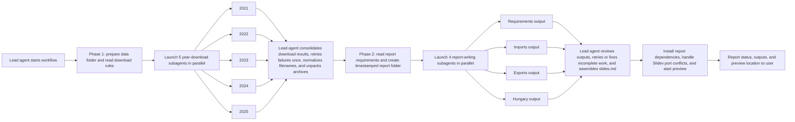

# COMEXT Analysis — Agent Instructions

This file is the single source of truth for the COMEXT analysis workflow in this repository.
It covers both data preparation and Slidev report generation. Treat it as superseding
`instructions/data-analysis-and-report-generation.md` for agent execution.

The repository workflow has two phases:

1. acquire and prepare COMEXT data
2. generate the Slidev report through explicit Codex subagent tasks

## Global conventions

- Working directory is the repo root. All relative paths below are relative to it.
- Raw data lives under `data/`. Never commit files from `data/`.
- Prefer idempotent operations: re-running a task must not corrupt prior results.
- Report progress concisely to the user after each major step and on any error.
- Read referenced source material before generating content that depends on it.

## Phase 1 — Acquire and prepare COMEXT data

Execute the steps below in order. Do not skip ahead.

### 1. Prepare the `data/` directory

- If `data/` does not exist at the repo root, create it.
- Do not delete existing contents.

### 2. Understand `download_data.sh`

Usage:

```bash
./download_data.sh <year>
```

- `<year>` is a 4-digit year.
- The script downloads all 12 monthly `.7z` archives for that year into `data/comext_raw_<year>/`.
- It uses `wget -c` (resumable), so re-running it is safe.

### 3. Download years 2021–2025 in parallel

- Launch one dedicated subagent per year for: `2021`, `2022`, `2023`, `2024`, `2025`.
- Each subagent runs `./download_data.sh <year>` for its assigned year only.
- Run all five subagents concurrently.
- After all subagents complete:
  - Report per-year success or failure to the user.
  - For any year that failed, retry it once in a fresh subagent. If it still fails, report the error and stop that year's pipeline; continue with successful years.

### 4. Normalize downloaded filenames

The downloaded filenames contain URL-encoded path fragments and are hard to read. Example raw filename:

```
files?file=comext%2FCOMEXT_DATA%2FPRODUCTS%2Ffull_v2_202412.7z
```

Apply these transformations, in this order, to every file under `data/` recursively:

1. **Strip the URL prefix.** Remove the leading literal `files?file=comext%2F` from the filename.
   - `files?file=comext%2FCOMEXT_DATA%2FPRODUCTS%2Ffull_v2_202412.7z`
   - -> `COMEXT_DATA%2FPRODUCTS%2Ffull_v2_202412.7z`
2. **Decode path separators.** Replace every remaining `%2F` with `_`.
   - `COMEXT_DATA%2FPRODUCTS%2Ffull_v2_202412.7z`
   - -> `COMEXT_DATA_PRODUCTS_full_v2_202412.7z`

Rules:

- Only rename files whose names still contain `files?file=comext%2F` or `%2F`. Skip already-normalized files.
- If a rename would overwrite an existing file, skip it and report a warning.

### 5. Unpack `.7z` archives

For each folder under `data/` recursively:

1. Extract every `.7z` file in that folder into the same folder with `7z x -y`.
2. Once all `.7z` files in a folder have been extracted successfully, delete the `.7z` files in that folder and notify the user.
3. If any `.7z` in a folder fails to extract, do not delete the `.7z` files in that folder. Report the failure and continue with other folders.

### 6. Phase 1 reporting

At the end of the data-preparation pipeline, print a short summary:

- Years downloaded successfully or failed.
- Folders fully unpacked and cleaned.
- Folders with remaining `.7z` files, with reason.

## Phase 2 — Generate the Slidev report with Codex subagents

This phase builds the COMEXT energy-trade presentation. The lead agent must combine this file
with prepared data from Phase 1 and the dataset reference in `docs/comext_investigation.md`.

### 1. Schema and processing rules

All slides, whether hand-authored or dynamically generated, follow the same schema:

| Field | Purpose |
| --- | --- |
| `id` | Stable slide identifier. Not rendered. |
| `layout` | Slidev layout name. |
| `title` / `subtitle` / `body` | Literal content unless prefixed with `GENERATE:`. |
| `styling` | Visual directives such as classes, icons, opacity, and spacing. |
| `agent_notes` | Instructions for the agent only. Never rendered. |

Additional rules:

- Process slides top-to-bottom. Never reorder them.
- `GENERATE:` means the agent must author the text using the description that follows and any referenced files.
- Read any referenced file before generating content that depends on it.
- Icons follow the [Iconify](https://icon-sets.iconify.design/) `set:name` convention, for example `mdi:target-arrow`.
- "`X% opacity`" applies to the element itself, not its container.

### 2. Domain constraints

#### 2.1 Analyze data on a per-capita basis

Gather population data for the countries being analyzed and include a dedicated slide immediately
after the dataset-description slide that presents each country alongside its population.

#### 2.2 SITC scope — energy and hydrocarbons only

Restrict every analytical step, including filtering, aggregation, and charting, to these SITC categories:

| Code | Label |
| --- | --- |
| `32` | Coal, coke and briquettes |
| `33` | Petroleum, petroleum products and related materials |
| `34` | Gas, natural and manufactured |
| `35` | Electric current |

Optional deeper drill-down subcategories:

| Code | Label |
| --- | --- |
| `333` | Crude oil |
| `334` | Refined petroleum products |
| `343` | Natural gas |

`PRODUCT_SITC` in the raw data may be 3 to 5 digits, so apply the filter as a prefix match, for example
`PRODUCT_SITC LIKE '32%'`.

If the source uses a different classification, first map it to the closest SITC code and note the mapping in the slide's `agent_notes`.

#### 2.3 Analytical rules

The deck must be useful as a quick business exploration of EU energy trade, not only as a
subagent workflow showcase. Keep the analysis aligned with the aggregate data model used by
the repository: `REPORTER`, `FLOW`, `PRODUCT_SITC` category, `YEAR`, `VALUE_EUR`,
`QUANTITY_KG`, and population. Do not require partner, product, BEC, CPA, or statistical
procedure questions unless the aggregation layer is explicitly extended to retain those fields.

##### A. Imports analysis (`FLOW = 1`)

For each SITC energy category, include:

1. **Top importers by value** — top 5 EU reporter countries by total `VALUE_EUR`, 2021-2025.
2. **Per-capita exposure** — top importer by `VALUE_EUR / population`, so small high-exposure countries are visible.
3. **2021 to 2025 movement** — largest absolute increase and decrease in import value by reporter.
4. **Category concentration** — share of the leading importer's total energy imports represented by the current SITC category.

##### B. Exports analysis (`FLOW = 2`)

For each SITC energy category, include:

1. **Top exporters by value** — top 5 EU reporter countries by total `VALUE_EUR`, 2021-2025.
2. **EU share shift** — reporter with the largest gain in EU export share between 2021 and 2025.
3. **Trend stability** — the most stable exporter among the top exporters, using coefficient of variation across yearly export values.
4. **Net supplier signal** — reporter with the largest positive `exports - imports` balance for the category.

##### C. Hungary analysis (`REPORTER = 'HU'`)

Include a Hungary scorecard before the SITC trend slides:

1. **2025 trade balance** — imports, exports, and `exports - imports` for each SITC category.
2. **Per-capita import exposure** — 2025 imports divided by Hungary's population.
3. **EU benchmark position** — Hungary's 2025 import value compared with the EU-27 average.
4. **Primary vulnerability signal** — the SITC category with the highest Hungarian per-capita import exposure.

Then include one trend slide per SITC category showing Hungary imports, exports, trade balance,
and EU-27 average import/export benchmarks from 2021 to 2025.


#### 2.4 Charting library

Use Vue and Chart.js only. No other charting library may be used.

Do not use `chartjs-plugin-colorschemes`. Use Chart.js built-in/default colors or an explicit
array matching the Chart.js default categorical palette. If a chart must pin semantic colors
for readability, for example Hungary imports versus exports versus balance, define those colors
directly in the Vue component or generated chart series and note that choice in `agent_notes`.

### 3. Execution model, outputs, and runtime

#### 3.1 Required Codex subagent workflow

The report-generation phase must be structured as exactly four explicit Codex subagent tasks.
The lead agent owns orchestration; subagents own chapter outputs.

Launch exactly these four report-writing subagents:

1. **Requirements subagent** -> writes `requirements-output.md`
2. **Imports subagent** -> writes `imports-output.md`
3. **Exports subagent** -> writes `exports-output.md`
4. **Hungary subagent** -> writes `hungary-output.md`

Rules:

- These four tasks are required. Do not collapse them into one agent or one monolithic generation pass.
- Each subagent owns only its assigned output document.
- The lead agent is responsible for launching the subagents, reviewing their outputs, and assembling the final `slides.md`.
- Prefer running the four report-writing subagents in parallel once the output folder exists.
- If a subagent output is incomplete or inconsistent with this spec, the lead agent must retry or correct that sub-task before assembling the final deck.

## Orchestration diagram



#### 3.2 Output folder

Write all generated files under:

```
./reports/comext-analysis-v--<YYYYMMDD>-<HHMM>/
```

The timestamp is the local generation time in 24-hour clock without seconds. Example:
`./reports/comext-analysis-v--20260421-1430/`.

#### 3.3 Required files in the output folder

- `requirements-output.md` — authored by the requirements subagent; contains the shared deck scaffold and Slides 1–5.
- `imports-output.md` — authored by the imports subagent; contains the full Imports chapter.
- `exports-output.md` — authored by the exports subagent; contains the full Exports chapter.
- `hungary-output.md` — authored by the Hungary subagent; contains the full Hungary chapter.
- `slides.md` — assembled by the lead agent by concatenating the four subagent outputs in this order: requirements, imports, exports, Hungary.
- `package.json` — must list `@slidev/cli` and `slidev-theme-neversink` as dependencies, plus `dev`, `build`, and `export` scripts.
- Any assets referenced by the deck — copy them in from the repo when this spec points at project files.

Assembly order must be exactly:

1. `requirements-output.md`
2. `imports-output.md`
3. `exports-output.md`
4. `hungary-output.md`

#### 3.4 Icon set installation

Slidev consumes Iconify icon sets as npm packages:

```bash
npm install @iconify-json/<icon-set-name>
```

If not already installed, install Material Design Icons via `@iconify-json/mdi`, because most icons in this spec use the `mdi:` prefix.

#### 3.5 Post-generation workflow — automatic

From the newly created presentation folder, run the following without asking for confirmation:

1. `npm install`
2. `npm run dev`

Launch the preview in the background so the user can open it in the browser.

#### 3.6 Port conflict handling

Slidev serves on port `3030`. If the port is already in use, likely due to a prior preview, free it before starting:

```bash
pkill -f slidev
```

Retry `npm run dev` once after killing the old process.

#### 3.7 Phase 2 reporting

At the end of report generation, summarize:

- which report-writing subagents succeeded
- which output documents were generated
- where the final Slidev deck was written
- whether the preview server was started successfully

### 4. Requirements subagent output

`requirements-output.md` is the dedicated deliverable of the requirements subagent.
This subagent writes the shared deck scaffold and Slides 1–5 only. It must not write the Imports,
Exports, or Hungary chapters.

The requirements subagent should render the fixed-structure opening slides below, substituting
all `GENERATE:` fields as required. To resolve the population requirement from Section 2.1,
include the country-population slide directly after the dataset-description slide.

#### Slide 1 — Cover

- **id**: `cover`
- **layout**: two-column
- **styling**:
  - Column gap: `gap-16`
- **left_column**:
  - **title** (GENERATE): a concise deck title derived from the dataset and investigation in `docs/comext_investigation.md`
  - **subtitle** (GENERATE): a one-line subtitle stating the scope and years covered
- **right_column**:
  - **body**: a single chart or graph icon chosen by the agent, such as `mdi:chart-line`, `mdi:chart-bar`, or `mdi:chart-areaspline`, centered and rendered at 5% opacity
- **agent_notes**:
  - Opening slide of the deck.
  - Ground the title and subtitle in the actual dataset, `ext_go_detail`, from COMEXT.

#### Slide 2 — Describe the data

- **id**: `describe-the-data`
- **layout**: centered
- **title** (GENERATE): a short title introducing the dataset
- **subtitle** (GENERATE): one or two sentences that must mention all of:
  1. the dataset — Eurostat COMEXT, `ext_go_detail`
  2. that it was obtained via the source API
  3. that the download and unzipping were AI-assisted and executed in parallel using subagents, one per year
- **agent_notes**:
  - Tone: light but direct, setting the stage rather than deep-diving.
  - Source of truth: `docs/comext_investigation.md`.

#### Slide 3 — Population context

- **id**: `population-context`
- **layout**: centered
- **title** (GENERATE): a short title introducing the population context
- **subtitle** (GENERATE): one sentence explaining that the analysis includes country population context for per-capita interpretation
- **body**: a structured table listing each country analyzed alongside its population
- **agent_notes**:
  - This slide fulfills the per-capita requirement from Section 2.1.
  - Place it immediately after the dataset-description slide.

#### Slide 4 — Data quality snapshot

- **id**: `data-quality-aspects`
- **layout**: centered
- **title** (GENERATE): a short title introducing the data quality snapshot
- **subtitle** (GENERATE): one sentence summarizing shape at a glance, for example "X million rows across N columns, covering 2021–2025."
- **body**: a compact summary table computed from the data after applying the SITC scope filter from Section 2.2

  | Aspect | Value |
  | --- | --- |
  | Total rows | `<computed>` |
  | Columns | `<count>` (`REPORTER`, `PARTNER`, `PRODUCT_SITC`, `FLOW`, `PERIOD`, `VALUE_EUR`, `QUANTITY_KG`, ...) |
  | Year coverage | `2021 – 2025` |
  | Distinct reporters | `<count>` |
  | Distinct products (`PRODUCT_SITC`) | `<count>` |
  | Missing `VALUE_EUR` | `<pct>%` |
  | Missing `QUANTITY_KG` | `<pct>%` |

- **agent_notes**:
  - Keep it an at-a-glance summary; do not profile every column.
  - Tone: light but direct.
  - Source of truth for the column list: `docs/comext_investigation.md`.

#### Slide 5 — Roadmap of the analysis

- **id**: `describe-the-analysis`
- **layout**: centered
- **title** (GENERATE): a short title introducing the structure of the analysis
- **subtitle** (GENERATE): one sentence stating that the rest of the deck has three chapters: imports, exports, and a Hungary deep-dive with year-over-year trends
- **agent_notes**:
  - Roadmap slide only; do not render chapter contents here.
  - The three chapters that follow are:
    1. **Imports** — top EU importers per SITC category, per-capita exposure, 2021-to-2025 movement, and category concentration
    2. **Exports** — top EU exporters per SITC category, EU share shifts, trend stability, and net supplier signals
    3. **Hungary** — a risk scorecard plus yearly imports, exports, balance, and EU-27 benchmarks

### 5. Chapter subagent outputs

Slides after the opening deck scaffold are emitted programmatically from the prepared CSV data.
Every generated slide still conforms to the schema in Section 1.

The three analytical chapters are separate Codex subagent tasks and separate output documents:

- `imports-output.md`
- `exports-output.md`
- `hungary-output.md`

Each chapter subagent must read the shared rules in this section, generate only its own chapter,
and leave final deck assembly to the lead agent.

#### 5.1 Data access contract

- **Source files**: `data/comext_raw_<year>/full_*.dat` for `<year>` in `2021`, `2022`, `2023`, `2024`, `2025`; these extracted `.dat` files are CSV-formatted
- **Column reference**: `docs/comext_investigation.md`
- Columns used by this spec:
  - `REPORTER` — 2-letter code of the reporting country; this is the country axis for ranking slides
  - `PARTNER` — trade partner country code
  - `PRODUCT_SITC` — SITC product code, 3 to 5 digits
  - `FLOW` — `1` for imports, `2` for exports
  - `PERIOD` — `YYYYMM`
  - `VALUE_EUR` — primary ranking metric
  - `QUANTITY_KG` — secondary metric
- **SITC filter**: keep only rows where `PRODUCT_SITC` begins with `32`, `33`, `34`, or `35`
- **Time window**: aggregate across all available months in 2021–2025 unless a slide says otherwise
- **Aggregate reporters**: drop values such as `EU27_2020`, `EU28`, and `EXT_EU27_2020` from individual-country rankings; keep them only when needed for the EU benchmark

#### 5.2 Metric definitions

- **Imports by country**: `sum(VALUE_EUR)` where `FLOW = 1`, grouped by `REPORTER`, filtered to the current SITC category
- **Exports by country**: `sum(VALUE_EUR)` where `FLOW = 2`, grouped by `REPORTER`, filtered to the current SITC category
- **Per-capita exposure**: `sum(VALUE_EUR) / population`, grouped by `REPORTER`, filtered to the current SITC category
- **Category concentration**: current SITC category value divided by the reporter's total energy-trade value for the same flow across SITC `32`, `33`, `34`, and `35`
- **2021 to 2025 movement**: `VALUE_EUR_2025 - VALUE_EUR_2021`, with percentage change when 2021 is non-zero
- **EU export share shift**: reporter's category export share in 2025 minus its category export share in 2021, measured in percentage points
- **Trend stability**: coefficient of variation across yearly export values for top exporters
- **Net supplier signal**: `sum(exports VALUE_EUR) - sum(imports VALUE_EUR)` for the same reporter and SITC category
- **EU-27 average**: per-year mean of per-country aggregates across EU reporters, excluding aggregate reporter codes

#### 5.3 Charting conventions

- Library: Vue and Chart.js only, using Chart.js default categorical colors or explicit Chart.js-compatible colors for semantic series
- Top-N ranking: horizontal bar chart, sorted descending
- Multi-year trend: line chart, x-axis is year `2021–2025`, one line per series
- Always show units, either `EUR` or `€`, and format large numbers with thousands separators
- Country labels should include the 2-letter ISO code plus the full English name where space allows

#### 5.4 SITC categories iterated

Every chapter emits one dynamic slide per category, in this order:

| Code | Label |
| --- | --- |
| `32` | Coal, coke and briquettes |
| `33` | Petroleum, petroleum products and related materials |
| `34` | Gas, natural and manufactured |
| `35` | Electric current |

#### 5.5 Template — category business view

Used by the Imports subagent and the Exports subagent.

- **id**: `<chapter>-<sitc>`, for example `imports-33` or `exports-34`
- **layout**: title + chart + insight cards, with chart on top and insight cards beneath
- **title** (GENERATE): `"<Imports|Exports> — SITC <code> · <label>"`
- **subtitle** (GENERATE): `"Top 5 EU reporter countries, 2021–2025, by total VALUE_EUR"`
- **body**:
  - **Chart**: horizontal bar showing the top 5 reporters by the current flow metric for the current SITC category
  - **Imports insight cards**:
    - Per-capita exposure leader — country code, full name, and `VALUE_EUR / population`
    - 2021 to 2025 movement — largest absolute increase and largest absolute decrease
    - Category concentration — current SITC share of the leading importer's total energy imports
  - **Exports insight cards**:
    - EU share shift — reporter with the largest export-share gain from 2021 to 2025
    - Stable exporter — most stable top exporter using coefficient of variation
    - Net supplier signal — reporter with the largest positive `exports - imports` value
- **styling**:
  - Chart full width at roughly 60% of slide height
  - Insight cards equal width with `gap-4`
- **agent_notes**:
  - Data comes from CSV-formatted `.dat` files under `data/comext_raw_2021..2025/`, filtered to `PRODUCT_SITC LIKE '<code>%'`
  - If fewer than 5 reporters have non-zero data, render what is available and note the count in the subtitle

#### 5.6 Template — Hungary trend

Used by the Hungary subagent.

- **id**: `hungary-<sitc>`, for example `hungary-33`
- **layout**: title + single chart + commentary
- **title** (GENERATE): `"Hungary — SITC <code> · <label>"`
- **subtitle** (GENERATE): `"Imports vs. exports, 2021–2025, with EU-27 average"`
- **body**:
  - **Chart**: multi-series line chart with one point per year
    - Series 1 — `HU imports`: yearly `sum(VALUE_EUR)` where `REPORTER = 'HU' AND FLOW = 1`
    - Series 2 — `HU exports`: yearly `sum(VALUE_EUR)` where `REPORTER = 'HU' AND FLOW = 2`
    - Series 3 — `HU balance`: yearly `HU exports - HU imports`
    - Series 4 — `EU-27 avg imports`: yearly mean across EU reporters for `FLOW = 1`
    - Series 5 — `EU-27 avg exports`: yearly mean across EU reporters for `FLOW = 2`
  - **Commentary** (GENERATE): 2 to 3 short bullets on the most salient trend, including direction of change, 2025 balance, and whether Hungary is above or below the EU average
- **styling**:
  - Hungary lines solid; EU-average lines dashed
  - Use distinct semantic colors for imports, exports, and balance
- **agent_notes**:
  - If a year is missing for Hungary, render a gap instead of interpolating
  - If the category has no Hungarian trade at all, replace the chart with one line of commentary saying so and keep the slide for structural consistency

#### 5.7 Imports subagent task -> `imports-output.md`

This is a standalone Codex subagent task. The subagent writes `imports-output.md` only.

1. Create a chapter intro slide:
   - **id**: `chapter-imports`
   - **layout**: centered section divider
   - **title**: `Chapter 1 — Imports`
   - **subtitle** (GENERATE): one sentence describing that the chapter covers import scale, per-capita exposure, category concentration, and 2021-to-2025 movement
2. Create one business-view slide per SITC category from Section 5.4 using the template in Section 5.5 with `<chapter> = imports` and `FLOW = 1`.

Do not include the opening slides, Exports slides, or Hungary slides in this file.

#### 5.8 Exports subagent task -> `exports-output.md`

This is a standalone Codex subagent task. The subagent writes `exports-output.md` only.

1. Create a chapter intro slide:
   - **id**: `chapter-exports`
   - **layout**: centered section divider
   - **title**: `Chapter 2 — Exports`
   - **subtitle** (GENERATE): one sentence describing that the chapter covers export scale, EU share shifts, stability, and net supplier signals
2. Create one business-view slide per SITC category from Section 5.4 using the template in Section 5.5 with `<chapter> = exports` and `FLOW = 2`.

Do not include the opening slides, Imports slides, or Hungary slides in this file.

#### 5.9 Hungary subagent task -> `hungary-output.md`

This is a standalone Codex subagent task. The subagent writes `hungary-output.md` only.

This chapter zooms in on `REPORTER = 'HU'` and tracks Hungary's energy trade across 2021–2025,
benchmarked against the EU-27 average.

1. Create a chapter intro slide:
   - **id**: `chapter-hungary`
   - **layout**: centered section divider
   - **title**: `Chapter 3 — Hungary`
   - **subtitle** (GENERATE): one sentence stating that the chapter shows Hungary's energy-trade scorecard and yearly import, export, and balance trends with EU-27 benchmarks
2. Create a Hungary scorecard slide summarizing 2025 imports, exports, balance, per-capita import exposure, and EU benchmark position for all four SITC categories.
3. Create one trend slide per SITC category from Section 5.4 using the template in Section 5.6.

Do not include the opening slides, Imports slides, or Exports slides in this file.

## Orchestration diagram
