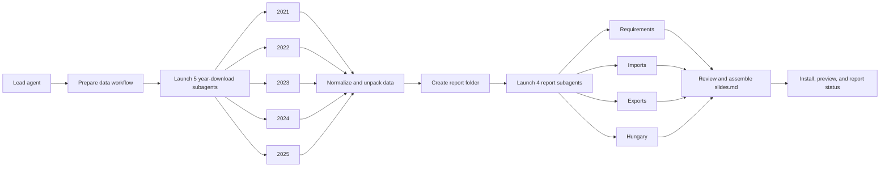

# COMEXT Analysis Codex Showcase

This project started with a simple question: can Codex subagents run a complete data workflow from collection to reporting?

Not just "generate a chart." Something closer to a real workflow:

- download multiple years of raw data
- normalize and unpack files
- aggregate the data
- split report generation into independent chapters
- assemble a presentation
- start a local preview server

The result is a COMEXT energy-trade analysis built from Eurostat data. The more interesting part is the workflow.

This repo is stronger as a subagent orchestration showcase than as a production-grade energy trade analysis. That distinction matters.

## What this repo tests

The source of truth is [`AGENTS.md`](AGENTS.md). In practice, it acts as a workflow contract. It defines:

- what needs to happen
- in what order
- what can run in parallel
- what each subagent owns
- what outputs are expected

The lead agent coordinates. Subagents execute narrow tasks. The instruction file defines the contract.

## Why subagents fit here

Subagents are useful when work can be split into clearly owned units. This project uses them in two places:

- Data collection: one subagent per year downloads COMEXT data for `2021`, `2022`, `2023`, `2024`, and `2025`.
- Report generation: four report-writing subagents produce separate outputs for requirements, imports, exports, and Hungary.

That keeps the main agent context cleaner. The lead agent does not need to carry every download log, every chapter draft, and every intermediate decision in one growing thread.

Instead, it delegates bounded work, collects compact results, checks consistency, and assembles the final deck.

## Phase 1: parallel data collection

The dataset covers five years, with 12 monthly COMEXT archives per year.

The workflow launches one subagent per year. Each subagent downloads its assigned year and does nothing else.

After download, the lead agent:

1. retries failed years once
2. normalizes URL-encoded filenames
3. extracts the `.7z` archives
4. deletes archives only after successful extraction

Raw data is stored under `data/` and should not be committed.

## Phase 2: parallel report generation

The second phase builds the Slidev presentation.

The report is intentionally split into four subagent-owned files:

- `requirements-output.md`
- `imports-output.md`
- `exports-output.md`
- `hungary-output.md`

The lead agent reviews those files and concatenates them into `slides.md` in this order:

1. Requirements
2. Imports
3. Exports
4. Hungary

The generated report lives under a timestamped folder:

```text
reports/comext-analysis-v--<YYYYMMDD>-<HHMM>/
```

## Orchestration at a glance



## What the report contains

The generated deck focuses on Eurostat COMEXT `ext_go_detail` and these SITC energy categories:

| SITC | Category |
| --- | --- |
| `32` | Coal, coke and briquettes |
| `33` | Petroleum, petroleum products and related materials |
| `34` | Gas, natural and manufactured |
| `35` | Electric current |

The workflow filters `PRODUCT_SITC` by prefix, so longer codes are included when they start with one of these categories.

The opening section includes dataset context, population context for per-capita interpretation, a filtered data-quality snapshot, and a roadmap.

The chapter outputs include:

- Imports: top importers by value, per-capita exposure, 2021-to-2025 movement, and category concentration.
- Exports: top exporters by value, EU share shifts, trend stability, and net supplier signals.
- Hungary: a 2025 scorecard plus yearly import, export, balance, and EU-27 benchmark trends.

The extracted source files are CSV-formatted `.dat` files under `data/comext_raw_<year>/`. The report analysis stays aligned with this aggregate data model: `REPORTER`, `FLOW`, `PRODUCT_SITC`, `YEAR`, `VALUE_EUR`, `QUANTITY_KG`, and population.

## Run the generated deck

The latest generated deck in this workspace is:

```text
reports/comext-analysis-v--20260425-1232/slides.md
```

To run it:

```bash
cd reports/comext-analysis-v--20260425-1232
npm install
npm run dev
```

Then open:

```text
http://localhost:3030/
```

## Important files

| Path | Purpose |
| --- | --- |
| `AGENTS.md` | Full execution instructions for Codex agents |
| `download_data.sh` | Downloads all monthly COMEXT archives for one year |
| `fix_file_names.sh` | Normalizes URL-encoded downloaded filenames |
| `docs/comext_investigation.md` | Dataset notes and column reference |
| `scripts/aggregate_month.sh` | Aggregates one monthly file into SITC energy summaries |
| `scripts/build_slide_data.py` | Builds the JSON bundle used by the report |
| `scripts/init_slidev_report.py` | Initializes a Slidev report folder |
| `scripts/render_report_section.py` | Renders one report section output |

## The important limitation

This repo is a workflow demo first.

A more serious energy-trade exploration would need partner-level data, product-level granularity, monthly analysis, and domain validation. The current aggregation is useful for a quick exploration, but it is not enough for deeper trade questions.

Subagents can move fast, but they cannot compensate for missing structure in the data model.

## Pattern demonstrated

The broader pattern is simple:

1. The lead agent reads the execution contract.
2. Independent work is delegated to subagents.
3. Subagents produce bounded, named artifacts.
4. The lead agent reviews those artifacts.
5. The final report is assembled and run locally.

That combination feels closer to an engineering workflow than a single large prompt.
